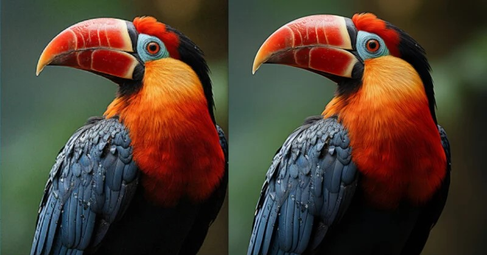

# 1. VisionScayl — AI-Powered Image Super-Resolution

[](https://www.python.org/)
[](https://fastapi.tiangolo.com/)
[](https://pytorch.org/)
[](https://developer.nvidia.com/cuda-zone)
[](LICENSE)



**VisionScayl** is a high-performance, 4x image super-resolution web application powered by **ESRGAN** (Enhanced Super-Resolution Generative Adversarial Networks) and **FastAPI**. It restores fine details, removes compression artifacts, and enhances image clarity in seconds.

---

## 2. Features

- 🖼️ **4x AI Super-Resolution:** Sharpens, enhances, and upscales low-resolution images by 400% using ESRGAN's deep RRDBNet architecture.
- ⚡ **FastAPI & Uvicorn ASGI:** High-throughput, modern asynchronous backend with fast response times.
- 🎮 **GPU & CUDA Acceleration:** Fully supports NVIDIA GPUs (including RTX 3050 and other 4GB+ cards) for near-instant upscaling.
- 🧩 **Memory-Safe Tiled Processing:** Automatically breaks large images into overlapping patches to prevent CUDA Out-Of-Memory (OOM) errors and seamlessly reconstructs the output.
- 🔄 **Graceful Auto-Fallback:** Automatically falls back to CPU processing if GPU memory is constrained.
- 🔌 **REST API & Swagger Docs:** Programmatic `/api/upscale` endpoint with interactive OpenAPI documentation at `/docs`.
- 💻 **Clean & Responsive UI:** Simple drag-and-drop / file upload, instant in-browser preview, and one-click download.

---

## 🛠️ Tech Stack

- **Deep Learning Core:** [PyTorch](https://pytorch.org/) (ESRGAN RRDBNet architecture)
- **Backend Framework:** [FastAPI](https://fastapi.tiangolo.com/) & [Uvicorn](https://www.uvicorn.org/)
- **Image Processing:** [OpenCV (cv2)](https://opencv.org/) & [NumPy](https://numpy.org/)
- **Frontend / Templating:** HTML5, CSS3, JavaScript, and [Jinja2](https://jinja.palletsprojects.com/)

---

## 3. Quickstart & Installation

### 1. Clone the Repository

```bash
git clone https://github.com/sandipan004/VisionScayl.git
cd VisionScayl
```

### 2. Create and Activate Virtual Environment

```powershell
# Windows
python -m venv .venv
.venv\Scripts\activate

# Linux / macOS
python3 -m venv .venv
source .venv/bin/activate
```

### 3. Install Dependencies

**For standard CPU execution:**
```bash
pip install -r requirements.txt
```

**For NVIDIA GPU / CUDA acceleration (Recommended):**
```bash
pip install -r requirements.txt
pip install torch torchvision --index-url https://download.pytorch.org/whl/cu126 --force-reinstall
```

### 4. Download ESRGAN Model Weights

Download the pre-trained `RRDB_ESRGAN_x4.pth` model checkpoint (~67 MB):

```powershell
# Windows (PowerShell)
curl.exe -L "https://huggingface.co/databuzzword/esrgan/resolve/main/RRDB_ESRGAN_x4.pth" -o RRDB_ESRGAN_x4.pth

# Linux / macOS
curl -L "https://huggingface.co/databuzzword/esrgan/resolve/main/RRDB_ESRGAN_x4.pth" -o RRDB_ESRGAN_x4.pth
```

### 5. Run the Application

```bash
python app.py
```

Open your browser and navigate to:
- **Web UI:** [http://127.0.0.1:5000/](http://127.0.0.1:5000/)
- **Interactive API Docs:** [http://127.0.0.1:5000/docs](http://127.0.0.1:5000/docs)

---

## 4. Programmatic REST API

VisionScayl provides a direct REST API endpoint for automated upscaling workflows:

### Endpoint: `POST /api/upscale`

**Using cURL:**
```bash
curl -X POST "http://127.0.0.1:5000/api/upscale" \
  -F "file=@input.jpg" \
  --output "output_4x.jpg"
```

**Using Python:**
```python
import requests

with open("input.jpg", "rb") as f:
    response = requests.post("http://127.0.0.1:5000/api/upscale", files={"file": f})

with open("output_4x.jpg", "wb") as f:
    f.write(response.content)
```

---

## 5. How to Use Web Interface

1. Open [http://127.0.0.1:5000/](http://127.0.0.1:5000/) in your browser.
2. Click **Choose File** to select your low-resolution image (`.jpg`, `.png`, `.webp`).
3. Click **Upscale Now**.
4. Preview the enhanced output and click **Download Image**.

---

## 📄 License

This project is licensed under the **GNU General Public License (GPL v3.0)**. See the [LICENSE](LICENSE) file for more details.

---

Elevate your images with **VisionScayl** — experience next-generation super-resolution AI today!
